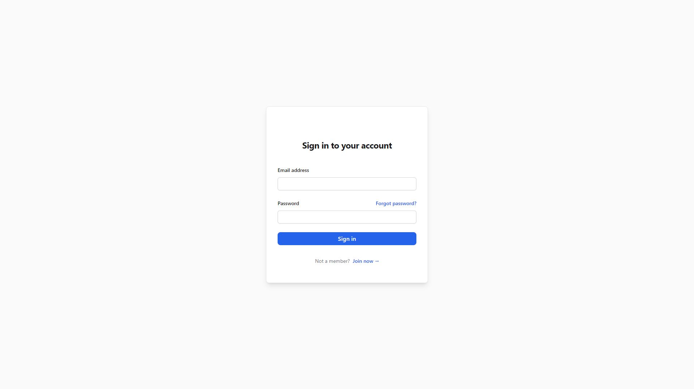
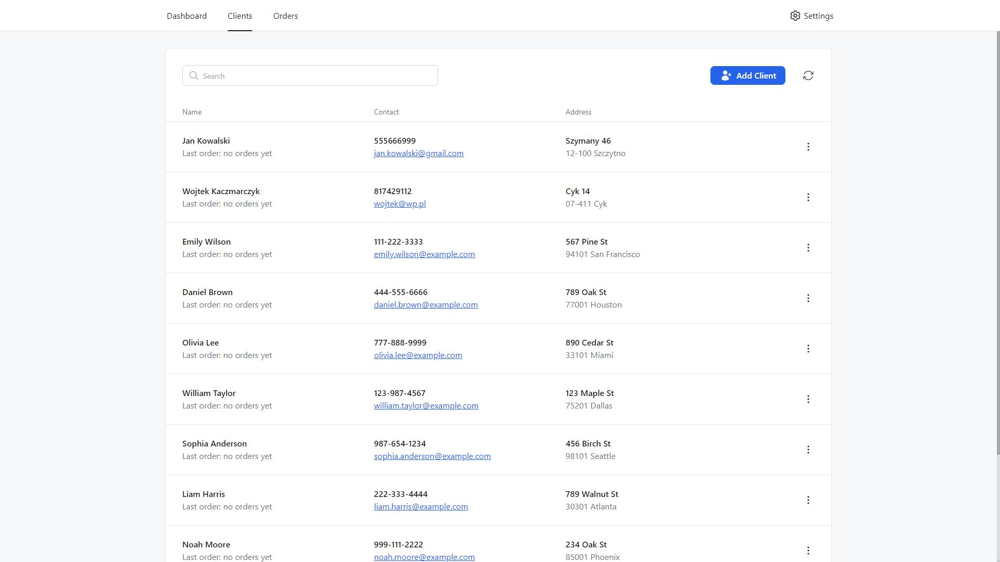
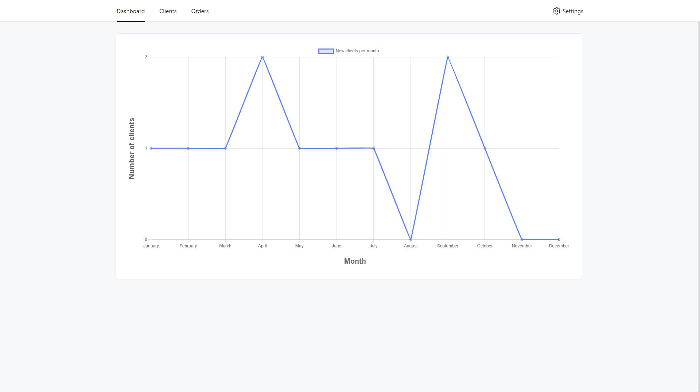
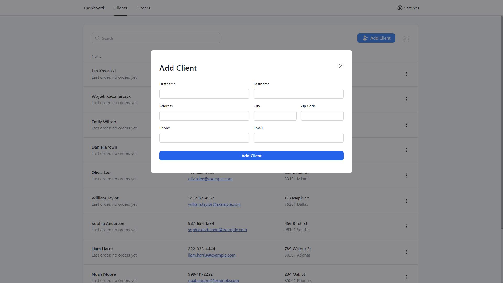
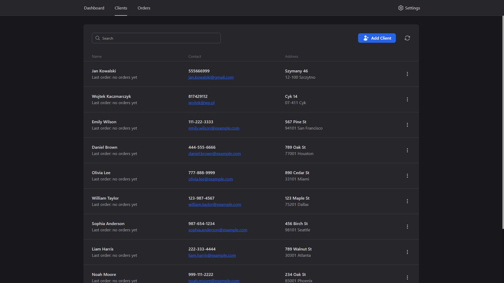

# ClientsManagmentSystem [still under development]
> Personal project of an application to manage the customer database (in future also orders and warehouse).   
> **Please note that the live version is hosted on a free server instance on render.com, because of that, the first request to the server will take 30-40 seconds as the server is disabled when there are no requests.**
> Live demo [_here_](https://www.example.com](https://clients-managment-system.vercel.app/)).  
> Example credentials  
> Email: **admin**  
> Password: **admin**

## General Information
My main goal in creating the project is to learn how to create
business logic and understand how similar applications work underneath.
I chose this type of project because of its complexity and potential for
future expansion, which will also be followed by my own development as a developer.
Right from the start, I encountered many problems and challenges, from the choice of technology
and interface design to the actual coding of the various functionalities. Despite the obstacles,
Creating this project helped me a lot to grow in areas such as Databases, Backend, Frontend, and even UI/UX. 

## Technologies Used

#### Frontend
- @formkit/auto-animate
- axios
- chart.js
- react
- react-chartjs-2
- react-dom
- react-router-dom
- react-spring
- react-transition-group
- sonner
- typescript-cookie
- vite-plugin-svgr
- zustand

#### Backend

- bcrypt
- cookie-parser
- cors
- dotenv
- express
- jsonwebtoken
- nodemon
- pg
- pg-hstore,
- sequelize

## Features
- authorisation
- operations on the customer base (adding, deleting, editing)
- dark mode
- form validation
- chart of new customers over months
- REST API for communication with the server
- database created in PostgreSQL

## Screenshots

## Contact
Created by [Maciej Kaczmarczyk](https://www.linkedin.com/in/maciejkaczmarczyk01/) - feel free to contact me!

